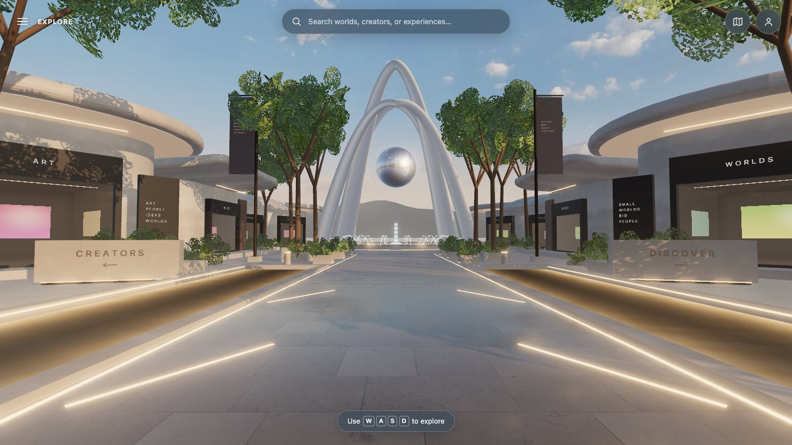
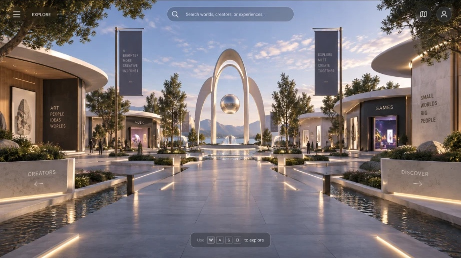

# Demo District

A walkable 3D community showcase for things people build with AI models.

Demo District turns discovery into a place: a pedestrian exhibition district with creator storefronts, project previews, model attribution, and deliberate links to the original experiences. Creator projects remain externally hosted by default; entering the district never preloads everyone's demos. Media or builds are hosted only with explicit permission.

## Current build

**World passes 1–3: the walkable plaza.** See [the checkpoint and side-by-side with the mockup](docs/PASSES_01-03.md).

The preview is now the Demo District plaza itself: golden-hour sky and lighting, stone boulevard and water channels, eight pavilions from a reusable kit with lit storefront interiors, the arch-and-orb landmark over a fountain, trees and planting, an entrance colonnade, a surrounding city, a lake, and mountains. You walk it with WASD and mouse on desktop, or drag and the stick on a phone, and you collide with everything solid. Storefronts carry signage and open a project preview by click, tap, or Enter; the listings are clearly marked samples until real project records exist ([pass 4](docs/PASS_04.md)). The mockup's HUD is in place with search, a map, and a loading screen ([pass 5](docs/PASS_05.md)). Desktop browsers are the primary target; phones and software-rendered browsers get lighter automatic quality tiers. Native ChatGPT Sites acceptance and physical-device testing remain pending. Nothing has been merged or deployed.



## Try the preview locally

Use Node 26 (Node 24 is also supported) and the committed npm lockfile. No credentials are required.

```sh
nvm install
nvm use
npm ci
npm run dev
```

Development runs at `http://127.0.0.1:5173` (add `?quality=high|medium|low` to force a rendering tier). On a phone, drag the scene to look and use the stick at the bottom left to walk. On a computer, choose **Explore** or click the scene, then use WASD to walk. Drag to look, or use arrow keys. Escape releases focus and Tab moves through the page controls. Reset view returns to the spawn. No pointer lock, head bob, jumping, or automatic camera movement is required.

```sh
node scripts/check-ci-policy.mjs
npm run verify
npx --no-install playwright install chromium
npm run test:browser
npm run test:lifecycle
npm run preview
```

Production preview uses `http://127.0.0.1:4173`. Browser tests start their own servers; ports 4173 and 5173 must be free. Lifecycle tests run serially and restore the source edit used to exercise actual hot reload.

[Deployment/Sites handoff](docs/DEPLOYMENT.md) · [Agent contract](AGENTS.md) · [Navigation](docs/NAVIGATION.md) · [Art direction](docs/WORLD_ART_DIRECTION.md) · [World engine](docs/WORLD_ENGINE.md)

## No paid GitHub Actions

CI uses only the standard `ubuntu-latest` runner and a job-level public-repository condition. It skips non-public repositories rather than consuming a paid private-repository allowance. Caches and artifact uploads are disabled; results stay in logs/job summaries. A dependency-free policy check rejects unapproved runners, extra jobs, paid services, and storage-related workflow changes. Run it before any workflow push.

This is a repository configuration/agent rule, not an account-wide billing lock. See [the cost policy and its boundaries](docs/CI_COST_POLICY.md).

## The destination



The approved visual direction ([details](docs/WORLD_ART_DIRECTION.md)) is a contemporary light-stone plaza with a strong central boulevard, landscaped pavilions, shallow water channels, warm golden-hour lighting, and a sculptural arch/orb landmark. The world must be attractive and usable before the full community platform is added.

Walking is optional. Search, a map, and direct navigation will provide faster ways to find projects. Listings will show the creator, source X post, model/version, description, permitted media, ratings, and a deliberate external launch action. Creators should have accessible claim, edit, and removal paths.

## Roadmap and implementation

[The detailed implementation plan](docs/IMPLEMENTATION_PLAN.md) contains 48 bounded slices; world slices 5–22 now run as seven passes. Execution evidence: [Slice 1](docs/SLICE_01.md), [Slice 2](docs/SLICE_02.md), [Slice 3](docs/SLICE_03.md), [Slice 4](docs/SLICE_04.md), [passes 1–3](docs/PASSES_01-03.md), [pass 4](docs/PASS_04.md), [pass 5](docs/PASS_05.md), and [pass 6](docs/PASS_06.md) ([performance budget](docs/PERFORMANCE_BUDGET.md)). The [WORLD ALPHA audit](docs/WORLD_ALPHA_AUDIT.md) is complete and recommends declaring WORLD ALPHA for the desktop preview; backend work waits for the owner's decision.

The build proceeds through engine/navigation, district construction, World Alpha, persisted project discovery, ratings/authentication, submissions/moderation, creator claims, and release checks. Work stays on `build/demo-district-v1`. Each requested slice ends at its defined boundary with checks and a checkpoint; merge and deployment require separate approval.

Current stack: portable TypeScript, direct Three.js, and Vite. ChatGPT Sites is the intended host, subject to native validation. Planned later storage/authentication choices must be validated against the eventual host before provisioning anything. No D1/R2/authentication or real creator records are active now.

V1 deliberately excludes multiplayer avatars, vehicles, voice chat, complex physics, fully modeled interiors for every property, a building editor, free-form comments, arbitrary project embeds, large-scale X scraping, infinite-city generation, and crypto/property ownership.

Demo District is an independent community exhibition project. Its goal is to help people discover what others are making, while sending attention and credit back to the original creators.
