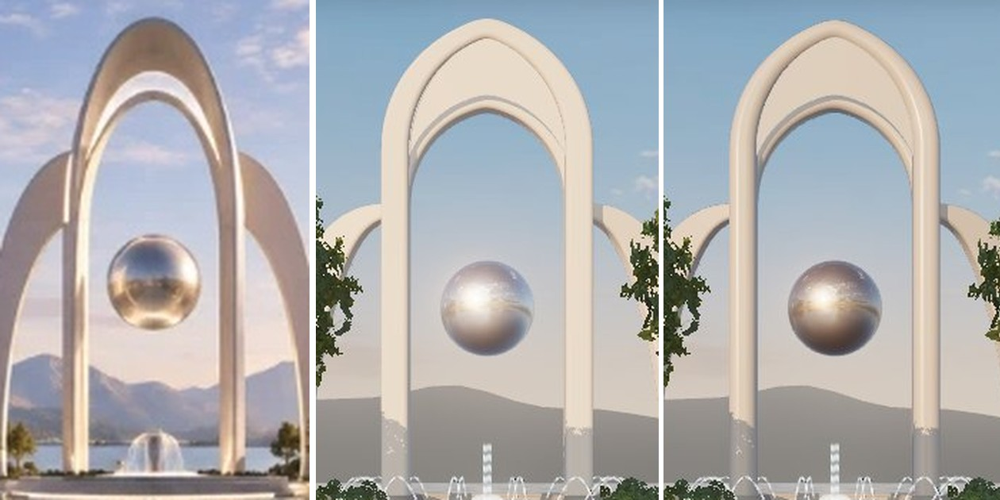

# Color grading — landmark statue and sphere against the mockup

**Branch:** `claude/blender-environment-support-darnhc` (after [LIGHTING_PASS.md](LIGHTING_PASS.md)) · **Status:** implemented and verified locally (software rendering). Not merged, not deployed.

## Method

The same patches were sampled in the mockup (`docs/art/plaza-mockup.jpg`) and in the spawn render (1440×810, SwiftShader, high tier) after every change:

- the sphere, as the inner 85 % of its disc;
- a strip down each main leg.

The measures were mean sRGB, luminance at the 5th, 50th, and 95th percentiles, and warmth (mean R − B).

Mockup (left), after the lighting pass (middle), and after grading (right).

| Patch | Mockup | Before (lighting pass) | After |
| --- | --- | --- | --- |
| Sphere, mean RGB | 156 141 135 | 186 175 171 | **157 140 130** |
| Sphere, luminance p5/50/95 | 94 / 133 / 227 | 103 / 179 / 245 | 68 / 138 / 233 |
| Sphere, warmth | 22 | 14 | 26 |
| Left leg, luminance p5/50/95 | 126 / 171 / 246 | 196 / 222 / 223 | 148 / 204 / 220 |
| Left leg, warmth | 34 | 30 | 33 |
| Right leg, warmth | 33 | 31 | 36 |

## Changes

- **Sphere** (`materials.chrome`): a warm tint (0xcdc6bf) on the polished metal. It went from pale, low-contrast silver to the mockup's darker champagne chrome, whose mean color, median brightness, and highlight range now match to within a few levels.
- **Statue** (`materials.arch`): near-neutral pearl stone (0xc9c6c1), roughness 0.34, clearcoat 0.65 at roughness 0.15. The sun supplies the warmth (it matches the mockup) and shaded faces take the sky's cool.
- **Statue section** (`tools/blender/landmark.py`): the main band's corner radius went from 0.32 m to 0.62 m (inner crown: 0.25 m to 0.4 m). The legs now read as rounded, with bright edge streaks like the mockup's, instead of flat fronts with one even value. Same triangle count (12.7k).
- **Finding:** in three.js r163+, when `scene.environment` lights a standard or physical material, the renderer uses `scene.environmentIntensity` and ignores the material's `envMapIntensity` (`WebGLRenderer.js`, "material.envMap === null && scene.environment !== null"). Earlier tuning of `envMapIntensity` on these two materials had no effect, so they are now graded by color alone. Other materials in `materials.ts` still set `envMapIntensity`. It is inert there too and is left for a separate cleanup.

## Remaining gap

The statue's body is still brighter than the mockup's: median 204 against about 170. The mockup's leg fronts sit at mid-tone with only their edges in light, as if the sun grazes from the side or behind. Ours face the sun at about 30° off axis.

Darkening the base color did not close it. It only turned the stone khaki, because the tone mapper compresses sunlit values. Closing it would need a more side-on sun, which the lighting pass rejected because it put the right-facing storefronts in cool shade.

## Checks (local, Node 26.10.0)

| Check | Result |
| --- | --- |
| `npm run verify` | 68 unit tests passed (including the landmark footing test against the rebuilt GLB); build and artifact check passed. |
| Browser | `district.spec` and `hud.spec`: 6/6 passed. |
| Visual | Spawn and plaza views; the sampled numbers above. |
