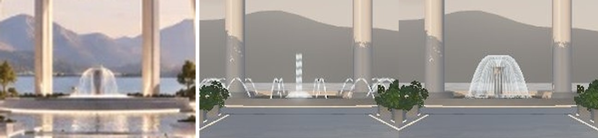
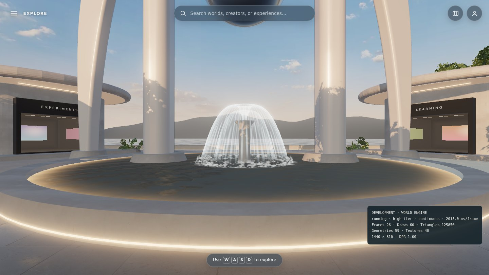
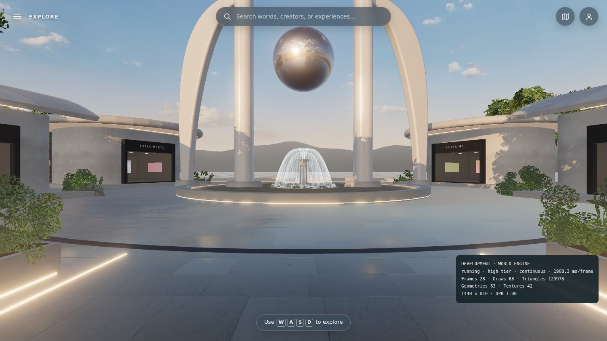
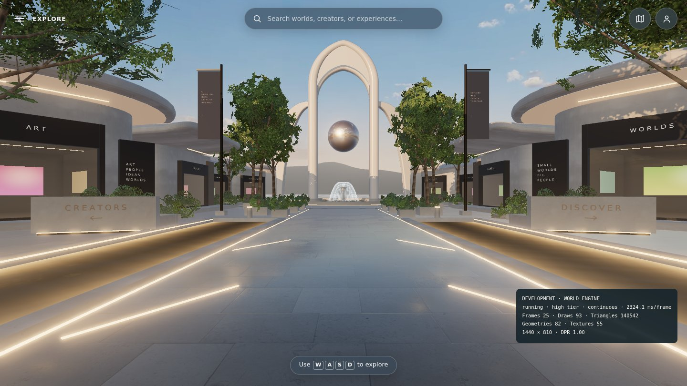

# Fountain — the mockup's bell fountain

**Branch:** `claude/blender-environment-support-darnhc` (after [COLOR_GRADING.md](COLOR_GRADING.md)) · **Status:** implemented and verified locally (software rendering). Not merged, not deployed.

## Why

The mockup's landmark fountain is a single central **bell fountain**: a slender stone pedestal throws a thin water sheet up and over into a glassy dome that falls back into the pool. The dome is bright where it is seen edge-on and nearly clear face-on, and there is white foam where it lands.

The pass-3 fountain was a ring of 14 arcing jets around a tall streaked column. It read as a different kind of fountain entirely.

Mockup, before, after (same crop from spawn):

| Close | From the plaza | Spawn |
| --- | --- | --- |
|  |  |  |

## Changes

- **`water.ts` `createFountain`.** Replaces the jet ring and column with:
  - **Outer water bell:** a lathe of a falling-sheet profile. Out of the nozzle at 2.25 m, over a rounded crown at 3.1 m, down to the pool at 2.4 m radius.
  - **Inner sheet:** a fainter second bell for depth.
  - **Central jet:** a short jet inside the dome.
  - **Foam:** a ring on the water and a low spray skirt where the sheet lands.
  - **Sheet shader:** additive, with the silhouette brighter (grazing angle), plus fine rivulet lanes whose brightness flows downward. The sheet breaks up as it falls and fades into the foam.
  - **Foam shader:** animated value noise.
  - `fountainBell` exports the shared dimensions.
- **`ground.ts`.** A lathed stone pedestal (stem and flared cup up to the nozzle) is added to the basin build. It merges into the existing stone batch, so it costs no draw call.
- **Motion.** It uses the existing `update` time. On the low tier, and under reduced motion, time holds still and the fountain still reads as water.

## Cost (SwiftShader counts, desktop 1440×900)

| View | Draws before → after | Triangles before → after |
| --- | --- | --- |
| high · spawn | 104 → 93 | 140.1k → 140.5k |
| high · plaza | 73 → 62 | 125.6k → 126.0k |
| low · spawn | 82 → 71 | 99.3k → 99.7k |

The 14 separate jet meshes are gone. That saves 11 draw calls for about the same triangle count.

## Checks (local, Node 26.10.0)

| Check | Result |
| --- | --- |
| `npm run verify` | 68 unit tests passed; build and artifact check passed. |
| Browser | 24 passed. The 5 failures are the known container set (canvas resize desktop/phone, touch stick ×2, reduced-motion walk), which the untouched base also shows here. |
| Lifecycle | 53 passed, 9 skipped by design. |
| Visual | Spawn, plaza, and close views on SwiftShader at the high tier, compared with the mockup crop above. |

## Not done

- The mockup's pool reflects the dome and the arch legs strongly. The basin's stylized water reflects only the sky: no planar reflection pass, per the original water design.
- Real-GPU judgement of the sheet's brightness against the backlit sky.
