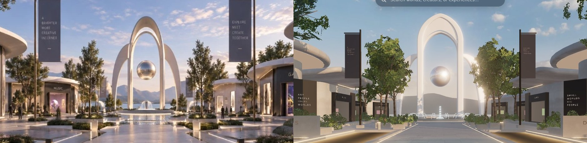
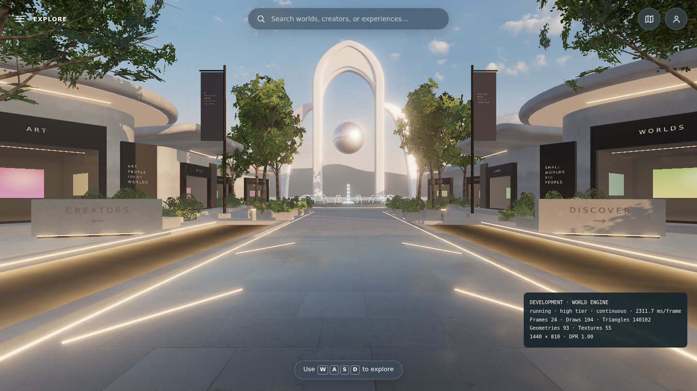
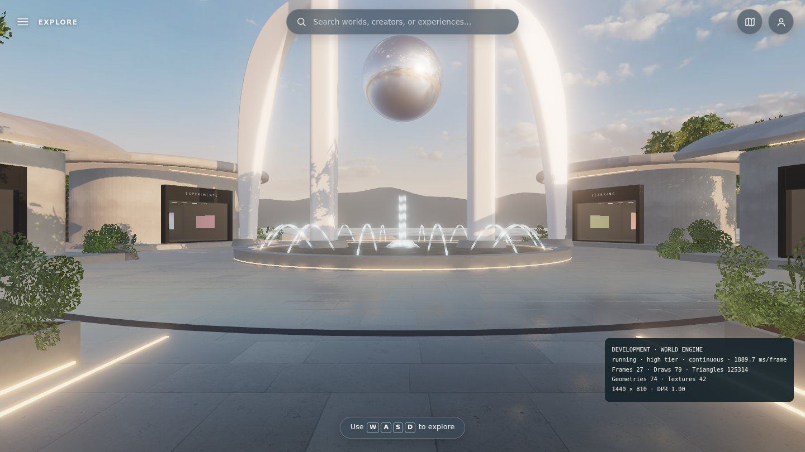
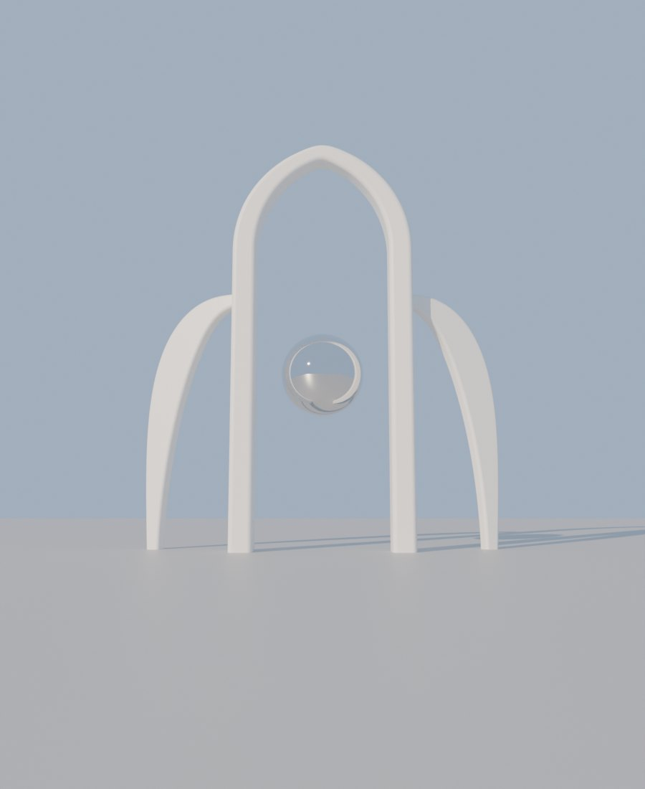

# Blender landmark — the arch sculpture after the mockup

**Branch:** `claude/blender-environment-support-darnhc` (after [TREES_BLENDER.md](TREES_BLENDER.md)) · **Status:** implemented and verified locally (software rendering). Not merged, not deployed.

## Why

The pass-2 landmark was three round tubes: a main arch whose legs converged like an "A", and two full wing arches crossing over its crown. The mockup's sculpture reads differently:

- a tall lancet main arch on straight, parallel legs;
- a deep, softened band section, whose underside shows at the crown;
- two crescent wings that rise outside the legs and join them where the crown springs, never crossing the opening;
- the orb hanging in clear sky.

Smooth swept bands with a controlled section are exactly what Blender is for.

Mockup (left) and this branch (right), same crop:

| Spawn | From the plaza | Blender (Cycles) |
| --- | --- | --- |
|  |  |  |

In-app views are headless Chromium with SwiftShader at the high tier. Judge the final look on a real GPU.

## Delivered

- **`tools/blender/landmark.py`.** Builds the whole sculpture as one mesh: 12.7k triangles, 84 kB meshopt-compressed.
  - **Main arch:** 10 m between leg centers. The legs rise straight to 19 m, then a lancet crown (arc radius 1.4 × half-span, apex softened) peaks at 25.7 m.
  - **Band section:** a rounded rectangle, 1.5 × 2.0 m at the base tapering to 1.1 × 1.6 m at the crown.
  - **Nested inner arch:** a second, lower lancet crown (apex ≈ 22 m) springs from the inner faces of the legs at 16.5 m. It is set 0.6 m back into the band's depth. A recessed web fills the space between the two crowns, so from the boulevard the crown shows the mockup's double outline with a lit band between. It adds no ground contacts.
  - **Wings:** crescent blades up to 2.5 m wide. Each rises from the ground outside a leg and joins it at 0.62 of the height, set 0.5 m behind the leg and yawed 20° back for depth.
  - **Footings:** the model records its ground contacts as mesh extras.
- **World integration.**
  - `landmark.ts` loads the model through the new shared `models.ts`, which the trees now use too, and places it with the district's satin arch material.
  - A procedural lancet covers loading and load failure.
  - The chrome orb (2.6 m radius at 11 m, same slow drift), the stone footings, and the fountain stay in code.
- **Layout.** `district.landmark` now describes the new sculpture (span 10, height 25.7, `wingFoot`). `landmarkFootings()` returns the two legs and the two wing feet, and drives both the navigation blockers and the footing geometry. The wing feet sit outside the fountain basin.
- **Consistency test.** `tests/unit/landmark-model.test.mjs` reads the GLB and fails if its footings or height disagree with the layout. It also checks that the tree GLB has every kind and level of detail.
- **Build.** `tools/blender/build.sh [model…]` replaces `build-trees.sh` and builds every model.

## Cost (SwiftShader counts, desktop 1440×900)

| View | Draws (trees → + landmark) | Triangles (trees → + landmark) |
| --- | --- | --- |
| high · spawn | 106 → 104 | 139.1k → 140.1k |
| high · plaza | 75 → 73 | 124.6k → 125.6k |
| low · spawn | 84 → 82 | 98.3k → 99.3k |

Without the nested inner arch (first landmark commit), spawn was 135.9k. The inner arch and web add 4.2k triangles and no draw calls.

## Verified execution (local, Node 26.10.0)

| Check | Result |
| --- | --- |
| `npm run verify` | 68 unit tests passed, including the new landmark and tree model checks; build and artifact check passed. The dist check requires both GLBs. |
| Lifecycle | 53 passed, 9 skipped by design. |
| Browser | 23 passed. The same five container-specific specs fail as on the untouched base (see [TREES_BLENDER.md](TREES_BLENDER.md)). The HUD menu spec also failed once: loading exceeded its 5 s wait under parallel workers. Production time-to-ready (6 runs, SwiftShader) was 2.9–3.2 s against the base's 2.7–2.9 s. `models.ts` now fetches each GLB in parallel with the loader chunk, which brings the median to 3.0 s against 2.9 s. HUD and district specs then passed 18/18 with `--repeat-each=3`. |
| Visual | Spawn and plaza views on SwiftShader at the high tier, compared with the mockup crop above (re-shot with the nested inner arch). |
| Nested inner arch | `npm run verify` passed (68 unit tests). HUD and district specs: one single-run failure on the same 5 s load wait, then 18/18 with `--repeat-each=3`. HUD spec ×6: 30/30 on this branch and 30/30 on the untouched base. |

## Not done / next

- Real-GPU comparison. The washed-out, haloed arch this checkpoint noted is fixed in the [lighting pass](LIGHTING_PASS.md).
- The web between the crowns is a flat plate. A curved soffit would catch light more like the mockup's, at a few hundred more triangles.
