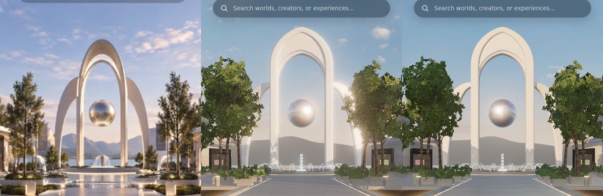
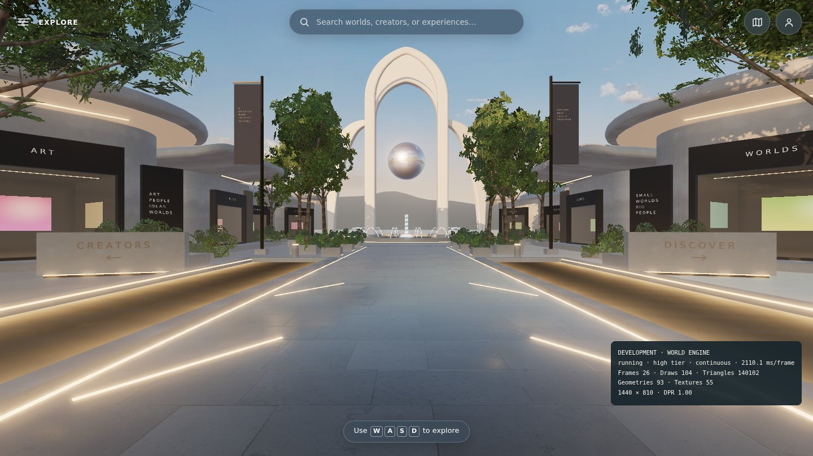
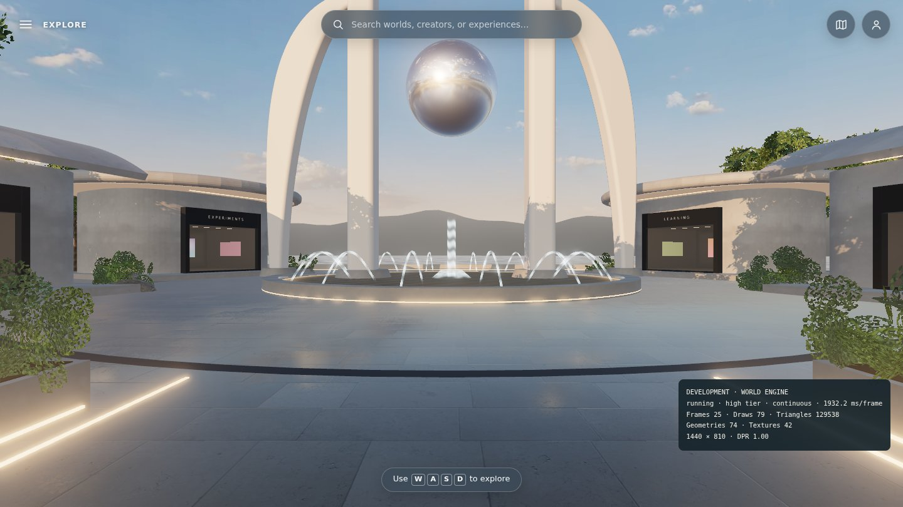
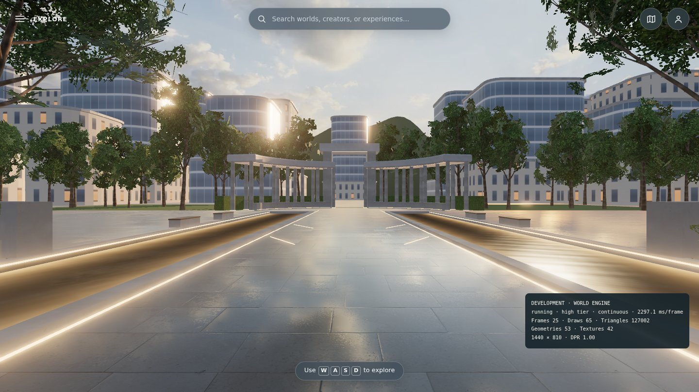

# Lighting pass — light direction, bloom, and landmark stone

**Branch:** `claude/blender-environment-support-darnhc` (after [LANDMARK_BLENDER.md](LANDMARK_BLENDER.md)) · **Status:** implemented and verified locally (software rendering). Not merged, not deployed.

## Problem

Against the mockup, the landmark read as a flat, over-bright white shape with a glow halo, and the plaza lacked directional golden-hour modelling. Three causes:

1. **Light direction.** The sky's sun (and with it the shadow sun) sat behind the visitor's right at spawn. Every face turned toward the boulevard got the same flat light. In the mockup, light rakes in from the left: the left faces of the arch and the left wing are lit, and the right wing falls into soft shade.
2. **Bloom threshold 1.05.** Meant for the LED strips, but sunlit white stone and the bright horizon sky also passed it. That produced the halo around the arch and washed out its silhouette.
3. **Arch material.** Near-pure white (0xfbf9f5) with 1.6× environment reflection and a clearcoat: too little form, too much reflected sky.

## Changes

| Where | Change |
| --- | --- |
| `environment.ts` | `skyYaw = 1.39` turns the whole sky, so the sun comes from behind the visitor's left, about 30° off the boulevard axis: the dome and all `sampleSky` reflections (water, storefront glass), the image-based light (the HDR's columns are rotated before PMREM), and the shadow-casting sun. They stay consistent with each other. |
| `post.ts` | Bloom threshold 1.05 → 1.5, strength 0.38 → 0.42. Now only emissive light blooms. |
| `materials.ts` | `warmLight` 2.4 → 3.0× so LED strips stay above the new threshold. The arch is warm cream stone (0xefe8dd), roughness 0.55, clearcoat 0.15, environment 1.0×. |

No geometry changes: draws and triangles are unchanged (spawn 104 draws, 140.1k triangles).

## Evidence (SwiftShader, high tier)

Mockup, before, after:

| Spawn | From the plaza | Looking back |
| --- | --- | --- |
|  |  |  |

- The arch reads as warm stone with form: lit left faces, a shaded right wing, and the orb's highlight on its left.
- The halo is gone, and the LED strips still glow.
- Looking back, the terrace, colonnade, and trees are backlit in warm light.
- A first try with the sun 49° off axis put the right-facing storefront facades into cool shade; 30° is the balance chosen. Storefronts under roof overhangs are shaded at either angle, and their warmth comes from the lit soffits, as in the mockup.

## Checks (local, Node 26.10.0)

| Check | Result |
| --- | --- |
| `npm run verify` | 68 unit tests passed; build and artifact check passed. |
| Browser | 25 passed. Four failures: canvas resize (desktop), touch stick ×2, and the HUD menu spec's 5 s load wait. The first three are the container-specific failures that also occur on the untouched base. See the handoff for the base comparison of the HUD spec. |

## Not done

- Real-GPU judgement of the exposure and warmth, per AGENTS.md.
- The distant ridge behind the landmark is a flat grey mass. The mockup shows blue, hazy mountains over a visible lake. That is an atmosphere and terrain change, out of scope here.
- The paving stays the deliberately cool grey from pass 7. The mockup's paving is warmer, with glossy sun reflections.
