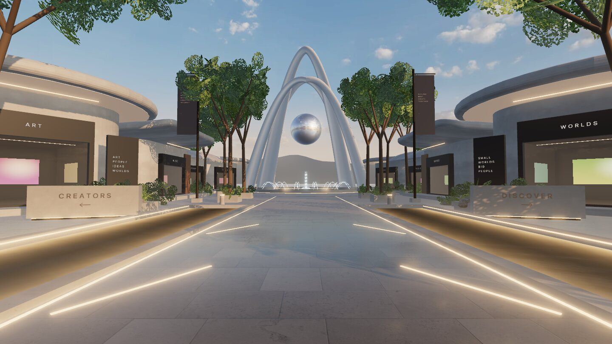
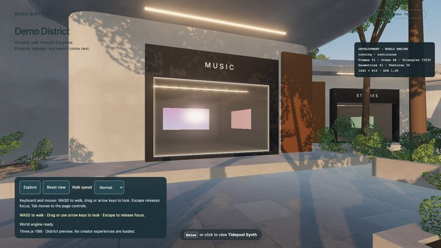
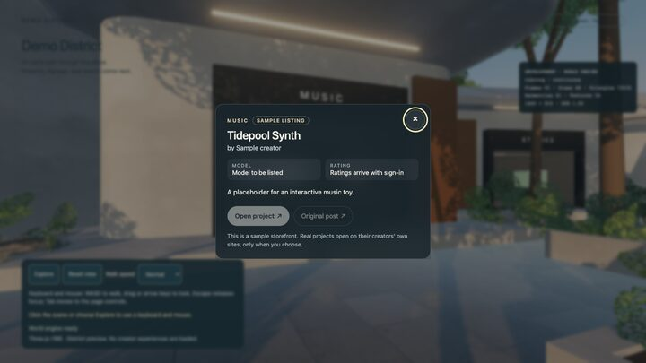

# World pass 4 — signage, interaction targeting, project preview (slices 13–15)

**Branch:** `build/demo-district-v1` · **Baseline:** `12f39de` · **Status:** implemented and verified locally; CI recorded after push.

| Spawn with signage | Focused storefront | Preview |
| --- | --- | --- |
|  |  |  |

## Delivered

- **Signage (slice 13).** `signage.ts` draws letter-spaced canvas text (system fonts, nothing remote), mipmapped and anisotropic to avoid shimmer, and auto-fits long words. Mockup-matched placements: engraved "CREATORS ←" / "DISCOVER →" on taller plinths, lit category names on every storefront sign band, stacked words on dark slabs beside the gate pavilions, and vertical banner text. All wording lives in `signage-copy.ts` because the words will be rewritten.
- **Sample showcase data.** `src/data/showcase.ts` holds eight sample listings, one per storefront. Each is flagged `sample`, credited to "Sample creator", and has no URLs, so nothing external can open. Slice 23 replaces this with the durable contract.
- **Targeting (slice 14).** Pure `targeting.ts` (ray vs. oriented box, nearest pick, forgiving proximity focus) plus `InteractionManager`, one contract for every input:
  - **Mouse:** hover marks the storefront (pointer cursor) and click opens it.
  - **Touch:** tap opens.
  - **Keyboard:** facing a storefront within 10 m shows "Enter or click to view …", or "Click to view …" until the scene has keyboard focus.
  - **Safety:** drags never activate. Only registered storefront volumes (generous, not pixel-exact) can be picked, so sky, trees, and architecture never steal clicks.
  - **Focus cue:** a fine warm line traces the storefront glass.
- **Preview overlay (slice 15).** A native modal `<dialog>` in the mockup's frosted style, with category, sample badge, title, creator, model, rating placeholder, description, and deliberate external actions (disabled for samples, with an explanation). Focus moves to Close; Escape, the close button, and backdrop clicks close it. Keyboard users return to the scene. The world takes no navigation or interaction input while it is open. It becomes a bottom sheet on phones. The close button needs no script (CSP-safe).
- **Mockup parity fixes found in review:** leaning framing trees fill the top corners, the horizon has a warm peach band, the sky is less saturated, planters use loose shrubs instead of black hedge blocks, and the gate pavilions moved back so their roofs do not swallow the framing trees.
- **Development-only `?spawn=x,z,yaw`** (stripped from production like `?engine-test`) starts the visitor anywhere, for tests and visual audits.

## Bugs caught by this pass's own checks

- **Touch tap-through:** the tap that opened the preview produced a trailing `click` on the new backdrop, closing it instantly. On real phones storefronts would have flashed shut. Backdrop close now requires the press to start on the backdrop.
- **Prompt honesty:** the prompt offered "Enter" before the scene had keyboard focus, when Enter does nothing.
- **Clipped signs:** "WORLDS" and "GAMES" overflowed their bands until auto-fit.

## Verified execution (local, Node 26.8.2)

| Check | Result |
| --- | --- |
| Unit tests | 58 passed (new: ray/box, picking, proximity, every storefront apron walkable and self-focusing). |
| Typecheck, build, artifact check | Passed. |
| Production browser | 25 passed, 9 skipped by design. |
| Lifecycle | 52 passed, 8 skipped by design. New: keyboard flow with focus return and input gating; mouse hover, click, drag, sky, and backdrop; touch tap vs. drag. |

The previous commit's CI run (sizing fix) passed all production browser tests. Its lifecycle failures were two assertions that required exactly one animation frame; the software tier now correctly idles at zero, so they assert at most one.

## Known gaps

- The HUD is still the temporary panel plus the new prompt pill; pass 5 replaces it with the mockup's HUD. On phones the prompt currently overlaps the intro text until then.
- Storefront interiors are generic at close range (a display and two posters); real media arrives with project records.
- Preview actions stay disabled until real listings exist (Slice 27 launch flow).
