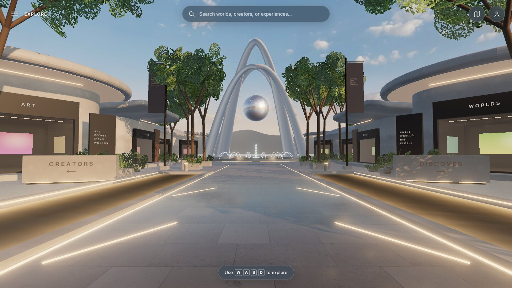

# World pass 5 — mockup HUD, search, map, loading (slices 16, 17, 21)

**Branch:** `build/demo-district-v1` · **Baseline:** `3a44800` · **Status:** implemented and verified locally; CI recorded after push.

| Mockup | Pass 5 HUD (desktop) |
| --- | --- |
|  |  |

Also: [search](art/pass-05-search.jpg), [loading](art/pass-05-loading.jpg) (the dark panel there is the development-only diagnostics HUD), [phone](art/pass-05-phone.jpg).

## Delivered

- **Mockup HUD.** The temporary slice-era panel is gone. Top left: the bare menu icon and "EXPLORE" label. Top center: the frosted search pill with the mockup's placeholder (shortened on narrow screens). Top right: round map and profile buttons (profile is honestly disabled until sign-in). Bottom: the keycap pill. Speed, reset, graphics, help, and status move into the Explore menu, a proper disclosure: its contents follow the button in tab order, Escape closes it and returns focus, and clicking the scene closes it. Explore and Reset close it too.
- **Search (slice 16).** An ARIA combobox over title, creator, model, and category (every word must match; title prefixes rank first). It supports arrow keys, Enter, and Escape, and has an empty state. Choosing a result jumps to that storefront and opens its preview.
- **Jumps.** Each storefront has a verified free viewpoint 3–6.5 m out that frames the storefront and its sign. The move is a 0.2 s fade to haze, then a 0.3 s fade in; under reduced motion it is instant. An arcing fly-over was built first and rejected in review: every workable height either flew through tree canopies or exposed the world's edge.
- **Map (slice 17).** A precomputed SVG schematic drawn from the layout data (not a second renderer), with the landmark at the top. It shows water, the plaza, the landmark footings, pavilions with their lit storefront edges, and a heading arrow for the visitor. Toggle it with the map button or M (never while typing or in a dialog). Storefronts on the map are keyboard-operable buttons that jump there; the focused storefront highlights.
- **Loading (slice 21).** A brand card with a real progress bar (texture sets, sky, lighting HDR) and staged messages; it dismisses when assets settle. The scene geometry is interactive immediately; textures stream in. If WebGL is unavailable, the brand stays and the explanation card appears over it. Healthy engine status is announced but not shown; the card appears only for graphics loss or failure.
- **Controller.** A new `teleport()` (constrained to walkable space; clears held input) replaces nothing.

## Bugs caught in this pass's own review

- Tab from the menu button skipped the menu's contents (DOM order). Fixed by placing the panel after its button.
- On narrow screens the menu button had no accessible name, because its visible label was hidden. It is now "Explore menu", which contains the visible word.
- Taps were rejected on slow frames: a time cutoff saw 1.4 s between a real tap's down and up under software rendering. Taps are now distance-only.
- Search arrivals were 1.3 m from the glass (all interior, no sign), and one viewpoint collided with a plinth. Viewpoints are now searched for and tested.
- The engine test rigs were blocked by the loading overlay that unmount correctly restores.

## Verified execution (local, Node 26.8.2)

| Check | Result |
| --- | --- |
| Unit | 61 passed (new: search matching and ranking, framed viewpoints free and focused). |
| Build and artifact check | Passed. |
| Production browser | 34 passed, 10 skipped by design. New `hud.spec`: loading, search jump, map (button, M key, slot jump, typing safety), menu disclosure, reduced-motion jump, honest profile. Navigation and touch specs were updated for the HUD, including a real Tab-order check. |
| Lifecycle | 52 passed, 8 skipped by design. |

## Known gaps

- The profile control is a placeholder until authentication (slice 29).
- The graphics selector is present but disabled until pass 6 wires it.
- The map is schematic; it does not yet label categories or zones.
