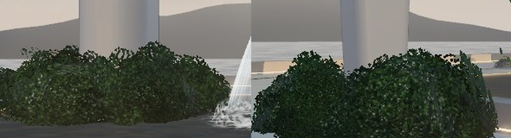

# Statue planting — shrubs that bury the landmark's footings

**Branch:** `claude/blender-environment-support-darnhc` (after [FOUNTAIN.md](FOUNTAIN.md)) · **Status:** implemented and verified locally (software rendering). Not merged, not deployed.

## Why

In the mockup, the landmark's legs rise out of a low band of dense, dark-green planting, so you never see where they meet the ground. Here the legs stood on bare stone footings: in the fountain basin for the main arch, and on the plaza for the wings. The owner asked for the mockup's planting, a little thicker.

Mockup, before, after (same crop from spawn):

| From the plaza | A wing foot | Shrub models (Cycles) |
| --- | --- | --- |
|  |  |  |

## Changes

- **`tools/blender/shrubs.py` → `public/world/models/shrubs.glb`** (158 kB). Three mounded shrubs built from leaf-spray cards on a lobed dome, with a generated atlas:
  - boxwood-like: tight small leaves;
  - glossy: larger leaves;
  - flowering: glossy leaves with small pale blossoms.

  The atlas reuses the tree script's leaf painter. Normals point out of the mound, and `COLOR_0` carries occlusion. Each shrub is 180–192 triangles.
- **Layout (`landmarkPlanters()` in `layout.ts`).** Each footing gets a round shrub bed, 0.6 m wider than the footing.
  - The main legs' planters (2.0 m) are islands in the basin, clear of the bell fountain's foam.
  - The wing feet's planters (1.6 m) are raised beds on the plaza, clear of the basin rim.
  - The beds, plus the shrubs' half-meter overhang, replace the footings as navigation blockers. A new unit test checks both clearances.
- **Planting (`landscape.ts`).** A tight ring of larger shrubs hugs each leg, and an outer ring overhangs the bed's edge: 46 shrubs across three kinds, instanced, 3 draw calls. If the file fails to load, the procedural leaf-card mound stands in.
- **No visible base (revision).** The first version sat the shrubs on raised stone drums, and the drum showed as a pale band under every mound. Now:
  - the basin beds' wall stops just under the waterline, and their soil sits at the water surface, so the shrubs rise straight out of the water;
  - the plaza beds are flush with the paving;
  - the outer ring moved out to overhang the edge, so foliage reaches the water or the ground all round.

  

## Cost (SwiftShader counts, desktop 1440×900)

| View | Draws before → after | Triangles before → after |
| --- | --- | --- |
| high · spawn | 93 → 96 | 140.5k → 149.4k |
| high · plaza | 62 → 65 | 126.0k → 134.9k |
| low · spawn | 71 → 74 | 99.7k → 108.6k |

Spawn is now at the 150k-triangle budget. The first build (120 cards per shrub and a denser outer ring) measured 153.1k and was trimmed to fit. Any further additions in view of spawn need an offset, for example a lighter LOD for the outer groves.

## Checks (local, Node 26.10.0)

| Check | Result |
| --- | --- |
| `npm run verify` | 70 unit tests passed: the new shrub-model and planter-clearance tests, the layout reachability tests with the planters as blockers, and the landmark footing test. Build and artifact check passed; the dist check now requires `shrubs.glb`. |
| Browser | 24 passed, including the asset spec updated to 17 local world assets. The 5 failures are the known container set (canvas resize desktop/phone, touch stick ×2, reduced-motion walk), which the untouched base also shows here. |
| Lifecycle | 53 passed, 9 skipped by design. |
| Visual | Spawn, plaza, and wing-foot views on SwiftShader at the high tier. |
