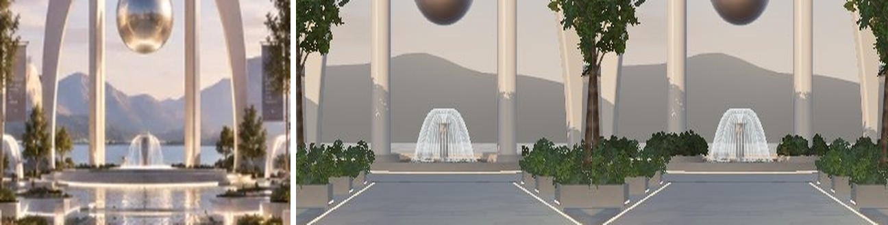
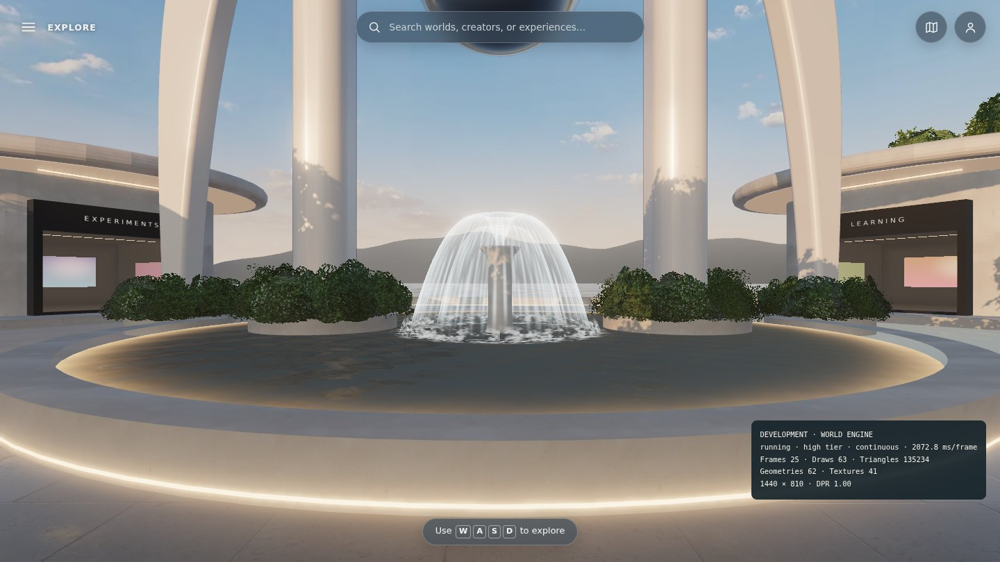
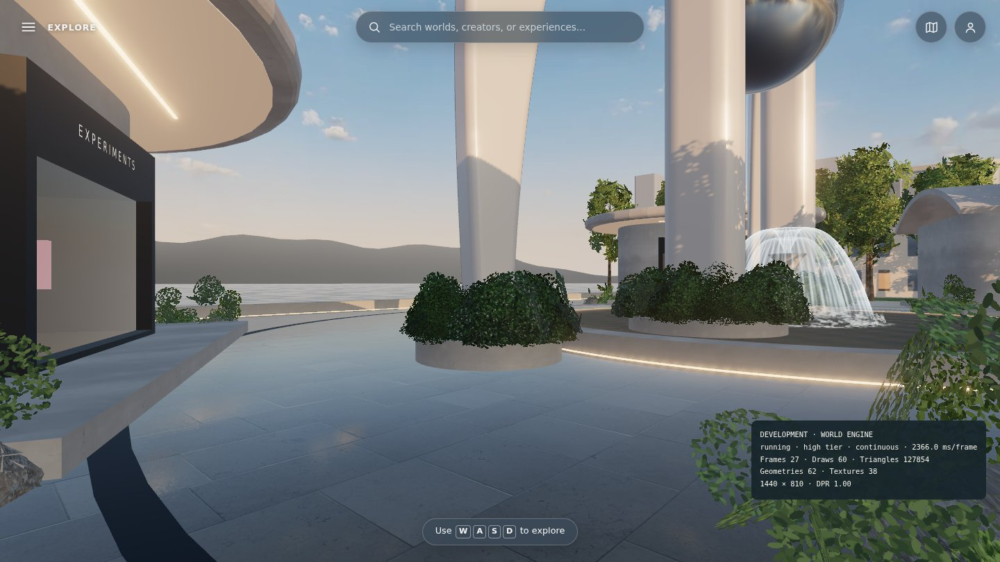
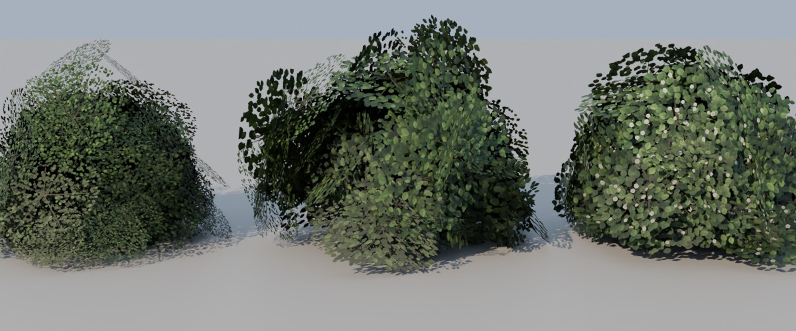

# Statue planting — shrubs that bury the landmark's footings

**Branch:** `claude/blender-environment-support-darnhc` (after [FOUNTAIN.md](FOUNTAIN.md)) · **Status:** implemented and verified locally (software rendering). Not merged, not deployed.

## Why

In the mockup, the landmark's legs rise out of a low band of dense, dark-green planting, so you never see where they meet the ground. Here the legs stood on bare stone footings: in the fountain basin for the main arch, and on the plaza for the wings. The owner asked for the mockup's planting, a little thicker.

Mockup, before, after (same crop from spawn):

| From the plaza | A wing foot | Shrub models (Cycles) |
| --- | --- | --- |
|  |  |  |

## Changes

- **`tools/blender/shrubs.py` → `public/world/models/shrubs.glb`** (158 kB). Three mounded shrubs built from leaf-spray cards on a lobed dome, with a generated atlas:
  - boxwood-like: tight small leaves;
  - glossy: larger leaves;
  - flowering: glossy leaves with small pale blossoms.

  The atlas reuses the tree script's leaf painter. Normals point out of the mound, and `COLOR_0` carries occlusion. Each shrub is 180–192 triangles.
- **Layout (`landmarkPlanters()` in `layout.ts`).** Each footing gets a round stone planter, 0.6 m wider than the footing.
  - The main legs' planters (2.0 m) are islands in the basin, clear of the bell fountain's foam.
  - The wing feet's planters (1.6 m) are raised beds on the plaza, clear of the basin rim.
  - The planters replace the footings as navigation blockers. A new unit test checks both clearances.
- **Planting (`landscape.ts`).** Each planter is a stone drum with a rim and soil (merged into the existing stone and soil batches). A tight ring of larger shrubs hugs the leg, and a lower ring spills toward the rim: 46 shrubs across three kinds, instanced, 3 draw calls. If the file fails to load, the procedural leaf-card mound stands in.

## Cost (SwiftShader counts, desktop 1440×900)

| View | Draws before → after | Triangles before → after |
| --- | --- | --- |
| high · spawn | 93 → 96 | 140.5k → 149.9k |
| high · plaza | 62 → 65 | 126.0k → 135.4k |
| low · spawn | 71 → 74 | 99.7k → 109.1k |

Spawn is now at the 150k-triangle budget. The first build (120 cards per shrub and a denser outer ring) measured 153.1k and was trimmed to fit. Any further additions in view of spawn need an offset, for example a lighter LOD for the outer groves.

## Checks

See the table below.
