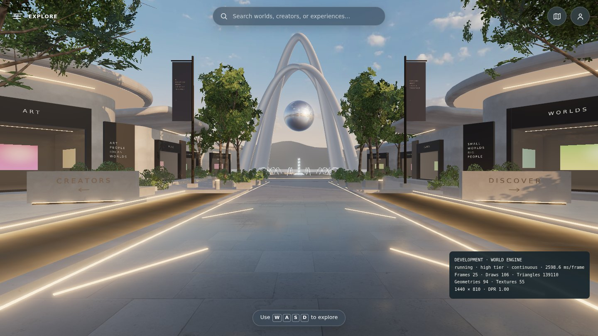
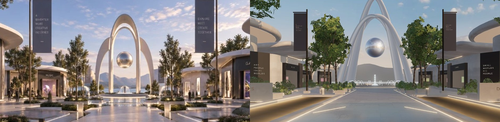
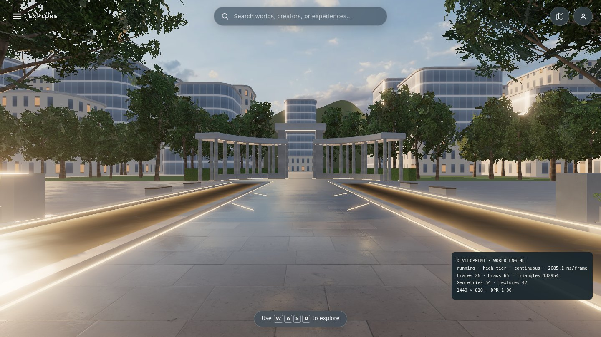
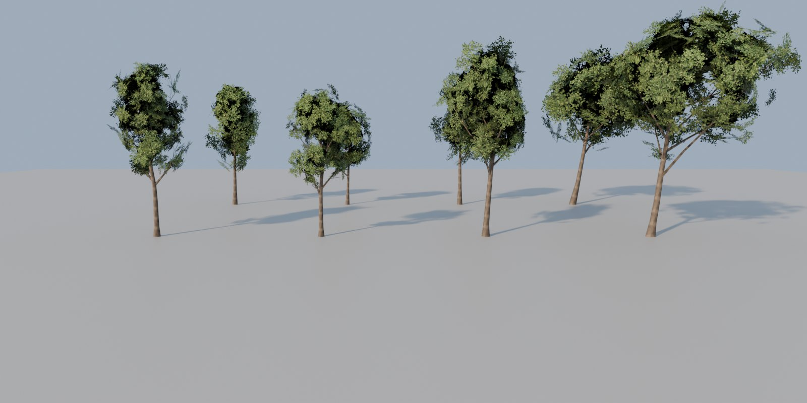

# Blender trees — first Blender-authored world asset

**Branch:** `claude/blender-environment-support-darnhc`, based on `build/demo-district-v1` at `02c5d48` · **Status:** implemented and verified locally (software rendering). Not merged, not deployed.

## Why

The WORLD ALPHA audit named vegetation as the largest remaining gap against the mockup
("leaf cards, not modelled foliage"). The pass-3 trees were a few straight limbs with
see-through leaf-card blobs. Trees are also the asset that gains most from real modelling and
depends on nothing else, so they are the first asset moved to a Blender pipeline. The layout,
pavilions, ground, water, collision, and signage stay procedural and data-driven.

| Before (pass 7) | After |
| --- | --- |
|  |  |

### Mockup comparison

Mockup (left) and this branch (right), same crop:

The first revision's crowns were too wide and solid: round balls with dark interiors. The mockup shows slim, upright young trees with clumped, airy crowns and trunks visible up into the crown. The revision:

- narrows the street-tree crowns to about 0.2 × height and raises them;
- slims the trunks;
- places leaf sprays in clumps around the primary limbs, with sky between them;
- uses a lighter green with less baked occlusion.

Remaining gap: the mockup's photoreal, warmly backlit foliage. The real-time render is a stylized likeness, as the WORLD ALPHA audit notes.

Looking back toward the terrace: 

Cycles preview of the models (LOD0 front, LOD1 behind): 

The "after" renders are headless Chromium with SwiftShader at the high tier. Judge the final
look on a real GPU.

## Delivered

- **`tools/blender/trees.py`.** Generates four trees: three upright street trees matching the mockup allee, and the leaning framing tree. Each gets two levels of detail, a trunk-and-branch skeleton clamped to a crown envelope, and leaf-spray cards with crown-outward normals and baked crown occlusion. A 1024² leaf-spray atlas and a tiling bark texture are painted in code, so there are no external inputs and the output is reproducible and license-clean. See [tools/blender/README.md](../tools/blender/README.md).
- **`public/world/models/trees.glb`.** 257 KB, meshopt-compressed with WebP textures.
- **World integration (`landscape.ts`).**
  - The trees load while the loading screen is up.
  - Planter, plaza, framing, and terrace trees use LOD0. Groves and street trees outside the district use LOD1.
  - The terrace line has its own instanced meshes, so it is culled when behind the visitor.
  - The foliage keeps the existing wind sway.
  - The glTF loader and meshopt decoder are a lazy chunk, not part of the main bundle.
  - Teardown during loading drops the result. A failed load falls back to the procedural trees; this was verified by removing the file.
- **Placement unchanged.** Positions, scales, rotations, and the random sequence are identical to before, and collision and layout are untouched.

## Cost (SwiftShader counts, desktop 1440×900; frame times on SwiftShader are not meaningful)

| View | Draws before → after | Triangles before → after |
| --- | --- | --- |
| high · spawn | 100 → 106 | 121.6k → 139.1k |
| high · plaza | 71 → 75 | 120.3k → 124.6k |
| high · promenade | 70 → 74 | 120.1k → 129.1k |
| high · storefront | 47 → 50 | 98.6k → 106.9k |
| high · looking back (HUD) | — | 133.0k |
| low · spawn | 83 → 84 | 81.1k → 98.3k |

- All views stay within the ≤ 120 draws and ≤ 150k triangles budgets.
- Main JS bundle: 687 → 717 kB. The lazy loader chunks add 71 kB (20 kB gzipped).
- Transfer: +257 kB for the GLB.
- The promenade, storefront, and lookback rows are from the first revision, before the crowns were thinned; they have since dropped slightly.

## Verified execution (local, Node 26.10.0)

| Check | Result |
| --- | --- |
| `npm run verify` | 66 unit tests passed; build and artifact check passed. The dist check now requires `world/models/trees.glb`. |
| Lifecycle (`npm run test:lifecycle`) | 53 passed, 9 skipped by design. |
| Browser (`npm run test:browser`) | The asset-count test was updated for the new GLB (14 → 15 local world assets) and now passes. Five specs time out in this container on both this branch and the untouched base `02c5d48`: canvas resize ×2, touch stick ×2, and reduced-motion walk. The base also failed a sixth. The container runs Playwright 1.63 against a shimmed older Chromium on 4 CPUs, so these are not attributed to the trees. CI is the clean record. |
| Visual | Spawn, plaza, lookback, and grove views on SwiftShader at the high tier; fallback at the low tier. |
| Reproducibility | Re-running `tools/blender/build.sh trees` (formerly `build-trees.sh`) produces a byte-identical `trees.glb`. |

## Not done / next

- Real-GPU comparison against the mockup, and frame times on the reference GPU.
- Shrubs and grasses are still the procedural leaf-card kit. They are the next Blender candidates, heavily instanced.
- Benches, planters, lights, and boulders could become a small Blender prop library.
- Storefront frames and canopy trim could be fixed-width Blender modules on the parametric pavilion shells. Roof curves stay procedural so they match the shell sizes.
