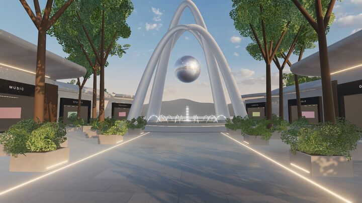
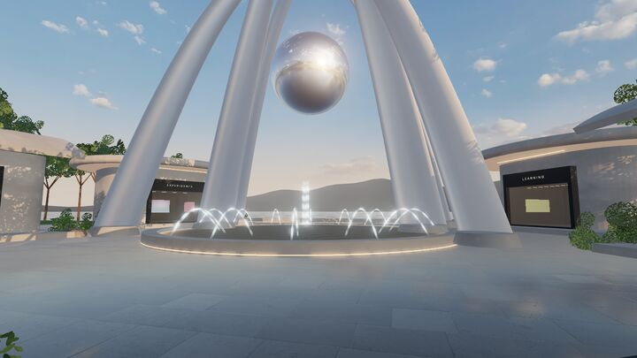
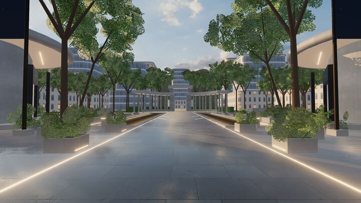
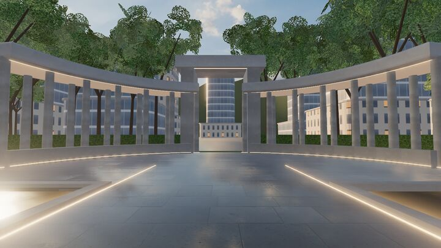
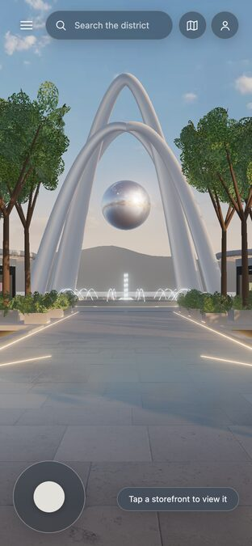
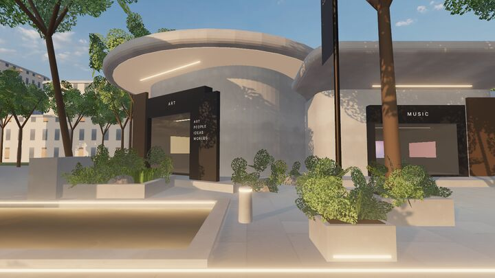

# WORLD ALPHA audit — slice 22 (world pass 7)

**Date:** 2026-09-25 · **Branch:** `build/demo-district-v1` · **Decision owner:** the project owner. This document recommends; it does not unlock backend work by itself.

| Approved mockup | Demo District today (desktop, high tier) |
| --- | --- |
|  |  |

| Mid-ground | Plaza | Looking back | Terrace | Phone |
| --- | --- | --- | --- | --- |
|  |  |  |  |  |

City ring beyond the pavilions: 

## Gate (implementation plan, section 11)

| Gate item | Status | Evidence |
| --- | --- | --- |
| Spawn view matches the selected direction | **Met, as a stylized real-time likeness** | Side-by-side above. Matches framing, the landmark at ~55 m, channels and plinths, flanking gate pavilions, golden-hour sky with a warm horizon, frosted HUD, and corner foliage. |
| Movement feels deliberately tuned | Met on desktop; untested with real users | [Navigation](NAVIGATION.md): smoothing, collision with sliding, speeds, reduced motion. |
| Desktop and mobile navigation work | Met in Chromium; physical devices pending | Keyboard, mouse, and touch lifecycle tests; phone layout tests. |
| Hero landmark exists | Met | Swept arches, chrome orb, fountain, lit basin. |
| Pavilion kit exists | Met | 8 pavilions, 3 roof families, one kit. |
| Landscaping exists | Met | Instanced trees, shrubs, grass, boulders, planters, hedges. |
| Water exists | Met | Channels, basin, lake; shader water with bank shading and LED spill. |
| Golden-hour lighting exists | Met | HDR image-based light, warm sun, warm bounce, haze, restrained bloom. |
| At least six interactive placeholder storefronts | Met (8) | Hover, click, tap, and Enter; lifecycle tests. |
| Preview overlay works | Met | Accessible dialog; focus return; input gating. |
| Search can jump or focus a storefront | Met | Search and map jumps to verified viewpoints. |
| No external project loaded at world entry | Met | Tests assert zero external requests; samples carry no URLs. |
| Performance is measured | Met | [PERFORMANCE_BUDGET.md](PERFORMANCE_BUDGET.md). |
| Baseline optimization is complete | Met | Static shadows, instancing and merging, DPR-aware MSAA. |
| Quality presets exist | Met | Automatic, High, Balanced, Light; live switch; adaptive governor. |
| We would willingly show a public screen recording | **Owner's call** | My assessment: yes, as a clearly labelled preview. |

## Audit fixes made in this pass

Each was found by reviewing renders against the mockup, and each is fixed only where it was high value:

- **Looking back from the plaza showed open lawn to the horizon (an empty area).** A curved stone terrace with an LED line, a clipped hedge, and a dense tree line now close the view.
- **The mid-ground was bare paving; the mockup lines the path with low lit planters.** Six lit planters with shrubs now line the path; the layout test proves the walkway stays clear.
- **Shaded facades read cool grey; the mockup's are warm beige.** A warm hemisphere bounce light, balanced so the paving stays mid-grey, fixes this.
- **Hedges tiled as polka dots.** Hedges now use a seamless leaf field.
- **Wood panels read orange in direct sun.** The texture is desaturated.
- A/B measurement under identical conditions shows no frame-time regression (+1 draw call, +10k triangles).

## Remaining gaps, by value

1. **Photorealism.** The mockup is an offline render. Vegetation is leaf cards, not modelled foliage; paving reflects only the sky (no planar or screen-space reflections); the mountains are simple.
2. **No people.** The mockup shows pedestrians. Crowds and NPCs are explicitly outside V1, so the plaza feels emptier than the render.
3. **Placeholder copy.** Sign, banner, and wall wording is modelled on the mockup and expected to be rewritten (`signage-copy.ts`).
4. **Storefront interiors are generic at close range** until real projects supply media.
5. **Distant edges (resolved after the audit, at the owner's request).** The open lawn around the district is gone:
   - An entrance colonnade with a central portal frames a civic tower on the axis.
   - A city ring of rounded glass and cream-stone blocks stands behind the side groves and past the entrance, lower toward the lake, on paved streets.
   - Planted hills rise behind it, and a faint, haze-toned skyline sits beside the mountains.
   - The lake side stays open.
   - A/B measurement shows no frame-time cost; triangles at spawn are 121k of the 150k budget.
   - Only the lake's far shoreline remains plain.
6. **Not yet validated:** physical iPhone and Android, Safari and Firefox, mid-range GPUs, native ChatGPT Sites hosting, and the full accessibility pass (slice 41).

## Recommendation

Declare **WORLD ALPHA for the desktop browser preview**. Every mechanical gate item is met with evidence, and the spawn view is recognisably the approved design. Before building the backend (slice 23 onward), I recommend three owner steps:

1. Walk it yourself on a desktop browser and on your phone (`npm run dev -- --host 0.0.0.0`).
2. Rewrite the placeholder sign copy.
3. Validate a native ChatGPT Sites save: D1, R2, and auth all depend on it.
