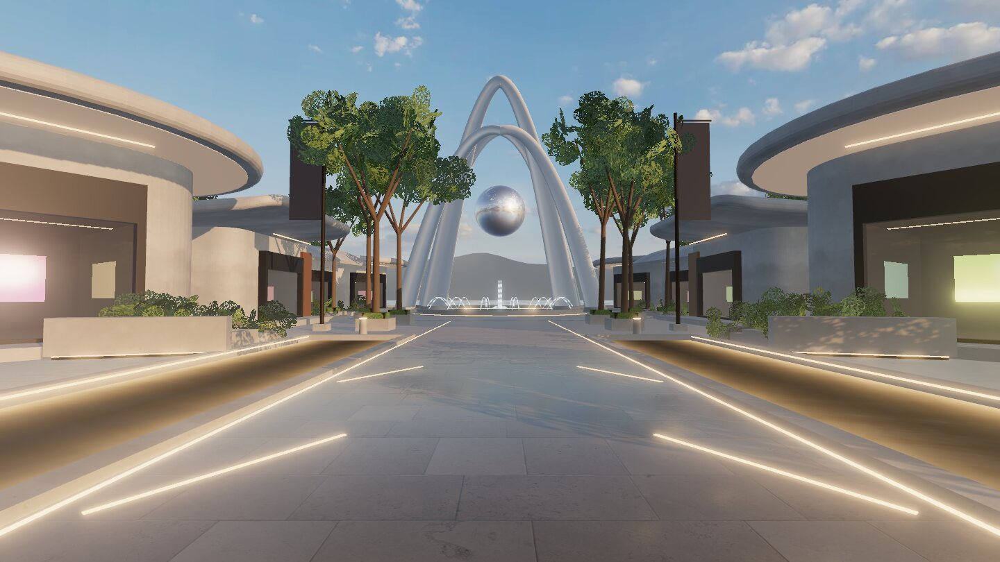

# World art direction

`art/plaza-mockup.jpg` is the approved target for composition, mood, and HUD style. It is a reference, not an asset sheet: build original geometry and materials that reach the same feeling. Words on the buildings, banners, and signs are placeholders to be rethought; do not copy them into the world.

## What the mockup establishes

- **Spawn view:** a strong central stone boulevard running straight to the landmark, which sits dead center and reads immediately.
- **Landmark:** tall, white, intersecting arches around a polished metal orb, over a fountain plinth, with mountains and water beyond.
- **Framing:** shallow linear water channels on both sides of the near walkway, with warm linear edge lights set into the paving.
- **Pavilions:** low, curved-roof pavilions in white stone and plaster, with warm wood accents and dark glass storefronts showing lit displays. They step back in rows along both sides.
- **Landscaping:** mature trees, low planters, grasses, and boulders that soften the hard edges without blocking the central path.
- **Light:** golden-hour warmth on the stone against a cool, clear blue sky. Architecture stays readable in shadow.
- **Signage:** restrained, integrated plinth and wall signs plus a pair of tall banners. Calm typography, no advertising noise.
- **HUD:** minimal frosted dark pills floating over the scene: menu at top left, search at top center, map and profile at top right, and a small input hint at bottom center. The Slice 4 movement stick follows this language.

## Current state (after world pass 3)

Matched: framing (landmark ~55 m ahead, channels and plinths in the foreground, gate pavilions flanking), golden-hour sun with a blue partly cloudy sky, white stone architecture with lit soffits and glowing storefronts, crossed white arches with a chrome orb, dark water with LED edge light, allee trees, lake and mountains.

Open gaps, by pass: signage text and banner messaging (4); the frosted HUD, search, and map (5); richer vegetation and mid-ground planters/lights, people or life, and quality tuning (6–7). The render is a stylized real-time likeness; it will not reach the mockup's offline photorealism, especially on lower tiers.

The implementation plan's art-direction guardrails (section 17) and WORLD ALPHA gate (section 11) govern how closely each pass must match.
